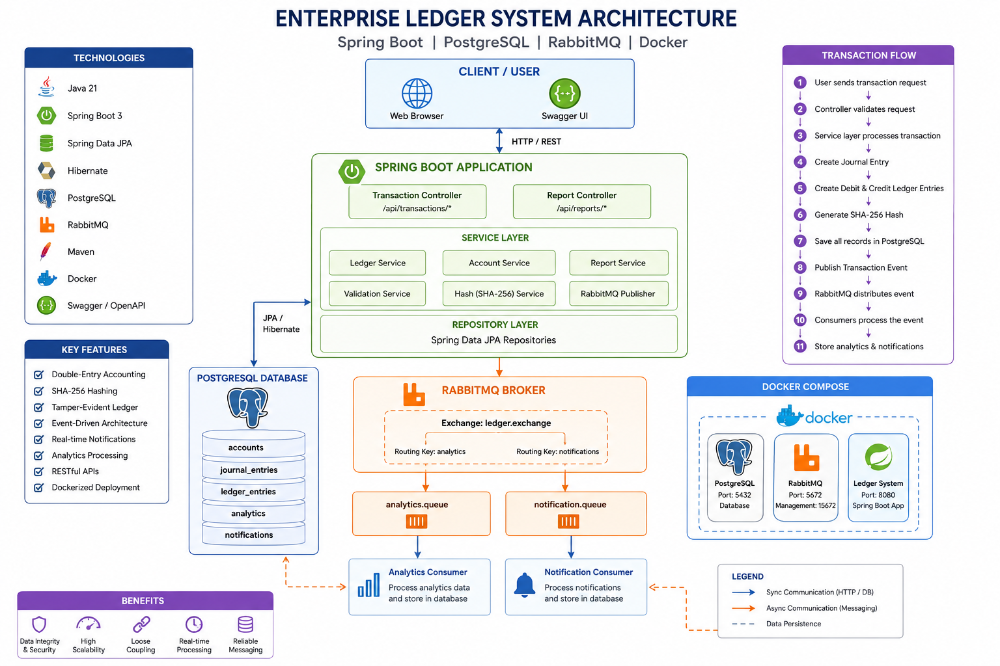
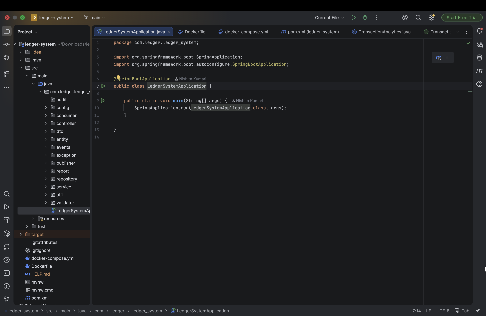
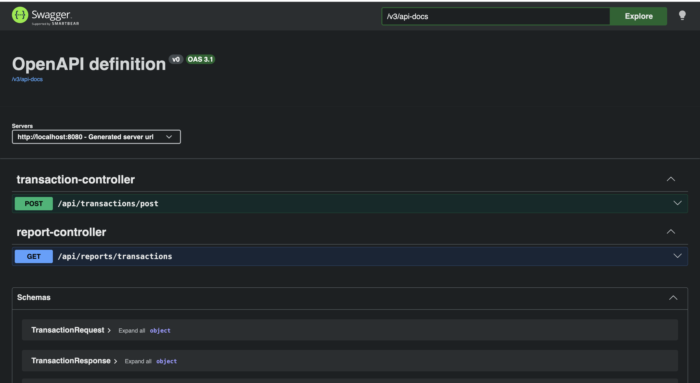
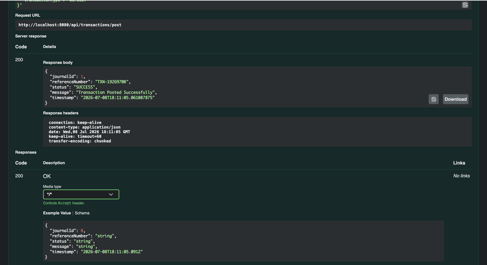
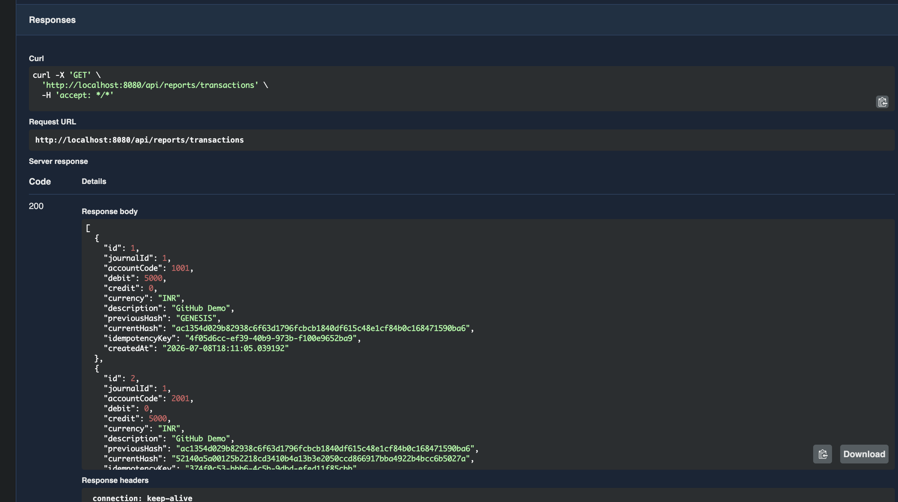

<div align="center">

# 🚀 Enterprise Ledger System

### Production-Inspired Double-Entry Accounting System using Spring Boot, PostgreSQL, RabbitMQ & Docker


</div>

---

# 📖 Overview

The **Enterprise Ledger System** is a production-inspired backend application that simulates the core functionality of enterprise accounting software used in banking and financial systems.

The application implements **Double-Entry Bookkeeping**, ensuring every transaction creates balanced debit and credit entries while maintaining complete financial integrity.

To mimic modern enterprise architecture, every successful transaction is published asynchronously using **RabbitMQ**, enabling analytics and notification services without affecting transaction performance.

The application also secures ledger records using **SHA-256 hash chaining**, making ledger entries tamper-evident.

---

# 🎯 Objectives

- Build a scalable financial transaction system.
- Demonstrate enterprise backend architecture.
- Implement Double-Entry Accounting.
- Publish asynchronous events using RabbitMQ.
- Secure ledger records using cryptographic hashing.
- Containerize the complete application using Docker.

---

# ✨ Features

## 💰 Double Entry Accounting

Every transaction automatically creates:

- Debit Ledger Entry
- Credit Ledger Entry
- Journal Entry

ensuring accounting balance.

---

## 🔐 Tamper-Evident Ledger

Each ledger entry stores:

- Previous Hash
- Current SHA-256 Hash
- Timestamp
- Idempotency Key

This creates a blockchain-inspired immutable ledger chain.

---

## 📨 Event-Driven Architecture

Whenever a transaction is posted:

- Transaction Event is published
- RabbitMQ distributes the message
- Analytics Consumer processes analytics
- Notification Consumer stores notifications

---

## 📊 Reporting APIs

Retrieve

- Transaction History
- Ledger Entries
- Account Reports

through REST APIs.

---

## 📖 Swagger Documentation

Interactive API documentation available through Swagger UI.

---

## 🐳 Dockerized Deployment

The project runs entirely using Docker Compose.

Containers include:

- PostgreSQL
- RabbitMQ
- Spring Boot Application

---

# 🏗 System Architecture

<p align="center">



</p>

---

# 🛠 Technology Stack

| Category | Technologies |
|-----------|--------------|
| Language | Java 21 |
| Framework | Spring Boot 3 |
| ORM | Hibernate |
| Persistence | Spring Data JPA |
| Database | PostgreSQL |
| Message Broker | RabbitMQ |
| Build Tool | Maven |
| Documentation | Swagger / OpenAPI |
| Containerization | Docker |
| Version Control | Git & GitHub |

---

# 📂 Project Structure

```
ledger-system
│
├── src
│   ├── config
│   ├── controller
│   ├── dto
│   ├── entity
│   ├── events
│   ├── publisher
│   ├── consumer
│   ├── repository
│   ├── report
│   ├── service
│   ├── util
│   └── validator
│
├── screenshots
├── Dockerfile
├── docker-compose.yml
├── pom.xml
└── README.md
```

---

# ⚙ System Workflow

### Step 1

Client sends a REST request.

↓

### Step 2

Transaction Controller validates the request.

↓

### Step 3

Ledger Service

- Validates accounts
- Creates Journal Entry
- Creates Debit Entry
- Creates Credit Entry

↓

### Step 4

SHA-256 hash is generated.

↓

### Step 5

Data is stored in PostgreSQL.

↓

### Step 6

RabbitMQ publishes Transaction Event.

↓

### Step 7

Consumers process:

- Analytics
- Notifications

↓

### Step 8

Reporting APIs retrieve stored ledger information.

---

# 📊 Database Tables

The application uses PostgreSQL with the following tables:

| Table | Purpose |
|--------|----------|
| Accounts | Chart of Accounts |
| Journal Entries | Financial Journals |
| Ledger Entries | Debit & Credit Records |
| Analytics | Analytics Data |
| Notifications | Notification Records |

---

# 📨 RabbitMQ Components

Exchange

```
ledger.exchange
```

Queues

```
transaction.queue

analytics.queue

notification.queue
```

Routing Key

```
ledger.transaction
```

---

# 🚀 REST APIs

## Transaction APIs

### Create Transaction

```
POST /api/transactions/post
```

---

## Reports

### Retrieve Transactions

```
GET /api/reports/transactions
```

---

# 📄 Sample Request

```json
{
  "debitAccount": 1001,
  "creditAccount": 2001,
  "amount": 5000,
  "currency": "INR",
  "description": "Wallet Deposit",
  "transactionType": "DEPOSIT"
}
```

---

# 📄 Sample Response

```json
{
  "message":"Transaction Posted Successfully",
  "journalId":7,
  "status":"SUCCESS"
}
```

---

# 🐳 Docker

## Build

```bash
docker compose build
```

---

## Start

```bash
docker compose up
```

---

## Stop

```bash
docker compose down
```

---

# 📖 Swagger

Open

```
http://localhost:8080/swagger-ui/index.html
```

---

# 📸 Screenshots

## Project Structure



---

## Swagger UI



---

## Transaction API



---

## Report API



---

## RabbitMQ Dashboard


---

## Docker Containers


---

# 🔒 Security Features

- SHA-256 Ledger Hashing
- Idempotency Keys
- Input Validation
- Immutable Ledger Chain
- ACID Database Transactions

---

# 📈 Future Enhancements

- JWT Authentication
- Role-Based Access Control
- Redis Caching
- Kafka Integration
- Email Notifications
- Grafana Monitoring
- Kubernetes Deployment
- CI/CD Pipeline using GitHub Actions

---

# 💡 Learning Outcomes

This project demonstrates practical experience with:

- Enterprise Backend Development
- RESTful API Design
- Event-Driven Architecture
- Database Design
- Asynchronous Messaging
- Docker Containerization
- Spring Boot Ecosystem
- Git & GitHub Workflow

---

# 👩‍💻 Author

**Nishita Kumari**

Computer Science Engineering (Data Science)

GitHub

https://github.com/YOUR_GITHUB_USERNAME

LinkedIn
https://www.linkedin.com/in/nishitakr/

---

# ⭐ If you found this project useful, consider giving it a Star!
